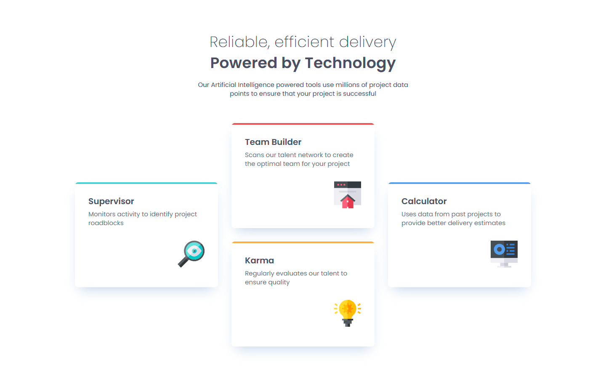

# Frontend Mentor - Four card feature section solution

This is a solution to the [Four card feature section challenge on Frontend Mentor](https://www.frontendmentor.io/challenges/four-card-feature-section-weK1eFYK). Frontend Mentor challenges help you improve your coding skills by building realistic projects. 

## Table of contents

- [Overview](#overview)
  - [The challenge](#the-challenge)
  - [Screenshot](#screenshot)
  - [Links](#links)
- [My process](#my-process)
  - [Built with](#built-with)
  - [What I learned](#what-i-learned)
  - [Continued development](#continued-development)
  - [Useful resources](#useful-resources)
- [Author](#author)

## Overview

### The challenge

Users should be able to:

- View the optimal layout for the site depending on their device's screen size

### Screenshot

### Links

- Solution URL: [github.com/RicardoGeada/fm-four-card-feature-section/](https://github.com/RicardoGeada/fm-four-card-feature-section/)
- Live Site URL: [ricardogeada.github.io/fm-four-card-feature-section/](https://ricardogeada.github.io/fm-four-card-feature-section/)

## My process

### Built with

- CSS Grid
- Mobile-first workflow
- [Angular](https://angular.dev/)
- SCSS

### What I learned

This project helped me strengthen my understanding of responsive design using CSS Grid. I learned how to structure grid layouts effectively across different screen sizes and gained confidence in using grid-template-areas for more complex arrangements.

### Continued development

I want to continue practicing CSS Grid and Flexbox in future projects to improve my ability to build clean, flexible, and responsive layouts. I'll also explore combining both techniques more efficiently depending on the design requirements.

### Useful resources

- [CSS Grid Layout Guide](https://css-tricks.com/snippets/css/complete-guide-grid/) - This helped me to work with css grid.

## Author

- Website - [ricardogeada.com](https://www.ricardogeada.com)
- Frontend Mentor - [@RicardoGeada](https://www.frontendmentor.io/profile/RicardoGeada)

